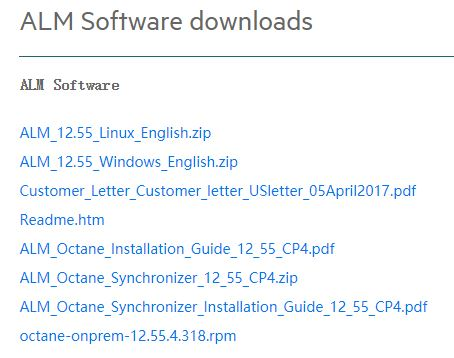
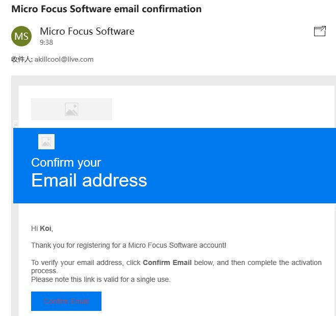

打开https://software.microfocus.com/zh-cn/node/55231，进入ALM/QC的下载页面：

点击下载ALM_12.55_Windows_English.zip，会自动跳转到MICROFOCUS的注册页面。

点击下面的Signup进行注册。

可以直接按照提示注册，这里选择上面的Autofill with GitHub。

弹出新页面进入GitHub授权

注册完成后在邮箱中进行验证

点击验证链接后输入邮箱和密码登录

再次进入第一个下载页面，就可以直接下载了